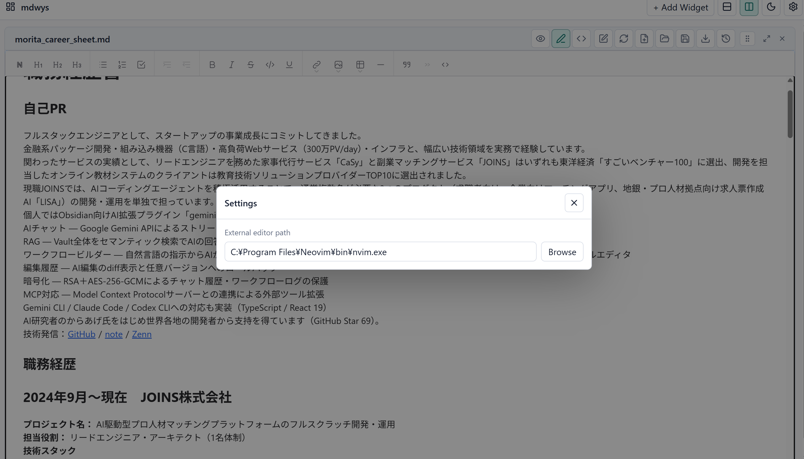

# mdwys

mdwys is a local desktop workspace for Markdown and document files. It lets you open files as movable widgets, arrange them in rows or columns, edit Markdown, preview documents, and reload changes made by an external editor.

Built with Go, Wails, Deno, Vite, React, and Wysimark.

[日本語 README](README_ja.md)


## Features

- Open local files as independent widgets.
- Supported file types: Markdown, plain text, HTML, EPUB, PDF, and common image formats.
- Markdown modes: Preview, WYSIWYG, and Raw.
- Add, move, resize, maximize, restore, and close widgets.
- Arrange widgets in row-oriented or column-oriented layouts.
- Drag and drop a file onto empty space to create a new widget.
- Drag and drop a file onto an existing widget to replace that widget's file.
- Set an external editor and open the current widget file from the widget toolbar.
- Reload a widget from disk after editing the file externally.
- Keep session history with split and unified diffs.
- Restore local-file widgets after restart when a file path is available.
- Light and dark themes.

## Screenshots

### Row Layout


### Column Layout


### External Editor



## Install

Download a binary from the GitHub Releases page. The executable does not require Deno or Go at runtime.

Release artifacts are built for:

- `mdwys-linux-amd64`
- `mdwys-linux-arm64`
- `mdwys-darwin-amd64`
- `mdwys-darwin-arm64`
- `mdwys-windows-amd64.exe`
- `mdwys-windows-arm64.exe`

## Usage

1. Start mdwys.
2. Click `+ Add Widget`.
3. Choose a local file.
4. Use the widget toolbar to switch Markdown mode, reload from disk, open the file in an external editor, view history, maximize, or close the widget.
5. Use the row/column buttons in the top toolbar to control how new widgets are arranged.

For external editor integration, open Settings and set the editor executable path. On Windows, for example:

```text
C:\Program Files\Neovim\bin\nvim.exe
```

## Keyboard Shortcuts

- `Ctrl/Cmd + O`: maximize the active widget.
- `Ctrl/Cmd + M`: restore a maximized widget.
- `Ctrl/Cmd + S`: save the current local state.
- `Ctrl/Cmd + E`: export the current document content.
- `Ctrl/Cmd + P`: open the widget file picker.
- `Esc`: close a modal.

## Development

Development requires:

- Deno 2.9 or newer
- Go 1.23 or newer
- Wails platform dependencies for your OS

Install frontend dependencies:

```bash
deno install --allow-scripts
```

Run the web UI:

```bash
deno task dev
```

Run the desktop app in Wails dev mode:

```bash
deno task desktop
```

Type-check and build the frontend:

```bash
deno task check
deno task build
```

Build the desktop app:

```bash
deno task desktop:build
```

Build a Windows ARM64 binary manually:

```bash
go run github.com/wailsapp/wails/v2/cmd/wails@v2.10.2 build -platform windows/arm64 -nopackage -o mdwys-windows-arm64.exe
```

## Release

Push a `v*` tag to build a draft GitHub Release:

```bash
git tag v0.1.0
git push origin v0.1.0
```

The release workflow builds Linux, macOS, and Windows binaries and uploads them as direct executable artifacts.
