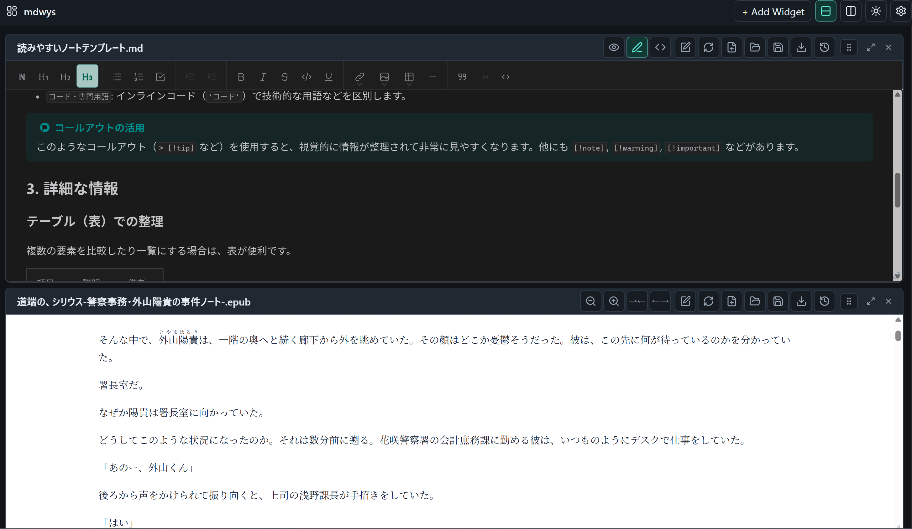
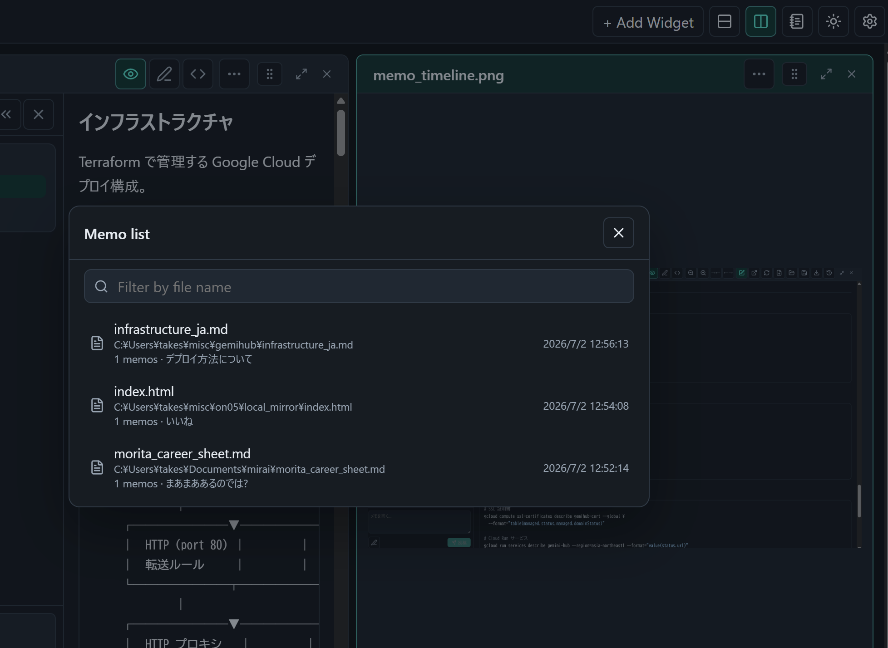
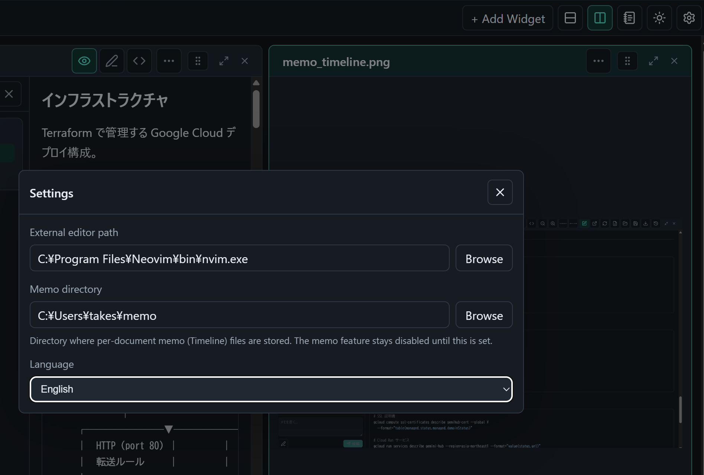

# mdwys

mdwys is a lightweight local desktop workspace for Markdown and document files. It lets you open files as movable widgets, arrange them in rows or columns, edit Markdown, preview documents, attach timeline-style memos to text in Markdown, PDF, and EPUB — with the quoted text highlighted in the document — and reload changes made by an external editor.

Built with Go, Wails, Deno, Vite, React, Wysimark, and pdf.js.

[日本語 README](README_ja.md)


*A Markdown document, a PDF, and an EPUB open side by side in one workspace.*

## Why mdwys?

mdwys aims at the sweet spot between a file previewer and an IDE: a single lightweight app that launches instantly from a double-click and covers the everyday loop of reading documents and writing notes.

- **Read a document, take notes right next to it.** Put a tech book (EPUB/PDF) or a spec in one widget and a Markdown memo in another. The row/column widget layout exists for exactly this — one workspace instead of juggling a reader, an editor, and a notes app.
- **Memos work the same way in Markdown, PDF, and EPUB — with highlights.** Select text in any of them, right-click, and post a memo. The quoted text is highlighted right in the document: hover to preview the memo, click to jump to the timeline entry, click the quote to jump back to the source. And every memo is a plain Markdown file you can read and edit with any tool.
- **More than a preview, less than an IDE.** The OS preview is look-but-don't-touch, and launching a full IDE for a one-line fix is overkill. mdwys opens a file instantly, handles quick edits in place (WYSIWYG or Raw), and hands serious writing off to your favorite editor with one click — reload picks up the changes when you are done.
- **Reading comfort you control.** Adjust the EPUB font size and page width to taste. Memo anchors re-resolve the quoted text after reflow, so highlights and jumps keep working.

## Features

**Widgets and layout**

- Open local files (Markdown, plain text, HTML, EPUB, PDF, images) as independent widgets: move, resize, maximize, and close them, arranged in row- or column-oriented layouts.
- Open files from the picker, by drag & drop (empty space creates a widget, an existing widget replaces its file), or as startup arguments — mdwys works as an "Open with" target.
- Local-file widgets are restored after restart.

**Viewing and editing**

- Markdown modes: Preview, WYSIWYG, and Raw.
- PDF viewing powered by pdf.js: continuous page rendering, zoom, page navigation, and text selection. EPUB with adjustable font size and page width.
- One-click hand-off to your external editor; reload picks up the changes. Session history with split and unified diffs.
- Light and dark themes. English and Japanese UI, following the system language.

**Memos**

- Select text in Markdown, PDF, EPUB, HTML, or plain text and right-click to add a memo with the quote and its location; the quoted text is highlighted in the document.
- Hover a highlight to preview the memo, click to jump to the timeline entry; quotes jump back to the document. Anchors survive EPUB reflow by re-resolving the quoted text.
- Timeline panel per widget: edit, delete, and pin entries, Raw/WYSIWYG composer, `[[wiki links]]`, collapsible to a narrow rail.
- Memos are plain Markdown files, one per document, in a configurable memo directory (see `specs/memo.md`).
- Memo list in the top toolbar: filter by file name, paging, and each entry shows the memo count and the beginning of the newest memo — a final note like "done reading" is visible at a glance.

## Screenshots

### Row Layout

The same workspace with widgets arranged in a row-oriented layout (the screenshot at the top shows the column-oriented layout).



### Memo Timeline

Select text in a Markdown, PDF, or EPUB document and right-click "Add to memo" to post a memo with the quote and its location. The quoted text is highlighted in the document, and anchored entries in the left panel jump back to it.


### Memo List

All files that have memos, sorted by last update. Each entry shows the memo count and the beginning of the newest memo.



### Settings

External editor path, memo directory, and UI language.



## Install

Download a binary from the GitHub Releases page. The executable does not require Deno or Go at runtime.

Release artifacts are built for:

- `mdwys-linux-amd64`
- `mdwys-linux-arm64`
- `mdwys-darwin-arm64`
- `mdwys-windows-amd64.exe`
- `mdwys-windows-arm64.exe`

On Linux and macOS, make the downloaded file executable:

```bash
chmod +x mdwys-linux-amd64
```

On macOS, the binary is unsigned, so clear the quarantine attribute on first run:

```bash
xattr -d com.apple.quarantine mdwys-darwin-arm64
```

## Usage

1. Start mdwys.
2. Click `+ Add Widget`.
3. Choose a local file.
4. Use the widget toolbar to switch Markdown mode, reload from disk, open the file in an external editor, view history, maximize, or close the widget.
5. Use the row/column buttons in the top toolbar to control how new widgets are arranged.

Files can also be opened by dragging them onto the window or by passing paths as startup arguments (`mdwys note.md book.epub`).

For external editor integration, open Settings and set the editor executable path. On Windows, for example:

```text
C:\Program Files\Neovim\bin\nvim.exe
```

### Memos

1. Open Settings and set the memo directory. The memo feature stays disabled until this is set.
2. Open a local file in a widget and click the memo icon in the widget toolbar to open the timeline panel on the left.
3. Select text in the document (Markdown preview, PDF, EPUB, HTML, or plain text) and right-click, then choose "Add to memo". The composer is pre-filled with the quote and its anchor; write your note and post.
4. Quoted locations are highlighted in the document while the panel is open. Click a highlight to jump to the entry; click a quote in the timeline to jump back to the document.
5. Use the memo list button in the top toolbar to find and reopen any file that has memos.

Each document maps to one Markdown file in the memo directory, so memos can be read and edited with any editor.

## Keyboard Shortcuts

- `Ctrl/Cmd + O`: maximize the active widget.
- `Ctrl/Cmd + M`: restore a maximized widget.
- `Ctrl/Cmd + S`: save the current local state.
- `Ctrl/Cmd + E`: export the current document content.
- `Ctrl/Cmd + P`: open the widget file picker.
- `Esc`: close a modal.

## Development

Development requires:

- Deno 2.9 or newer
- Go 1.23 or newer
- Wails platform dependencies for your OS

Install frontend dependencies:

```bash
deno install --allow-scripts
```

Run the web UI:

```bash
deno task dev
```

Run the desktop app in Wails dev mode:

```bash
deno task desktop
```

Type-check and build the frontend:

```bash
deno task check
deno task build
```

Build the desktop app:

```bash
deno task desktop:build
```

Build a Windows ARM64 binary manually:

```bash
go run github.com/wailsapp/wails/v2/cmd/wails@v2.10.2 build -platform windows/arm64 -nopackage -o mdwys-windows-arm64.exe
```

## Release

Push a `v*` tag to build a draft GitHub Release:

```bash
git tag v0.7.0
git push origin v0.7.0
```

The release workflow builds Linux, macOS, and Windows binaries and uploads them as direct executable artifacts.
