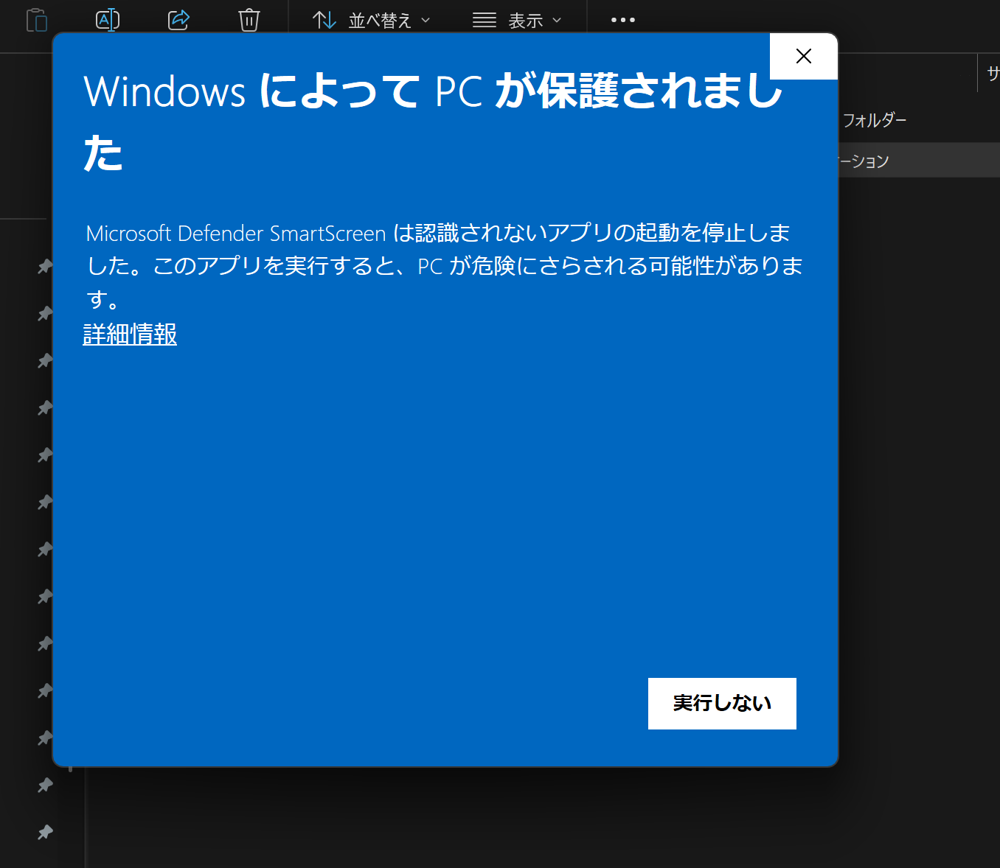

# mdwys

mdwys は、Markdown やドキュメントファイルをローカルで扱う軽量な desktop workspace です。最大の特徴は Timeline 形式のメモ: Markdown・PDF・EPUB のどれでも、テキストを選択して右クリックするだけで引用と位置付きのメモが残せます。引用箇所は本文にハイライト表示され、メモと本文の間を相互にジャンプできます。ファイルは widget として行・列に並べられ、Markdown の編集(Preview / WYSIWYG / Raw)や外部エディタ連携にも対応します。

Go、Wails、Deno、Vite、React、Wysimark、pdf.js で作っています。

[English README](README.md)


*Markdown ドキュメント・PDF・EPUB を 1 つのワークスペースに並べて表示。*

## なぜ mdwys?

mdwys が狙うのは「プレビュー以上、IDE 未満」の立ち位置です。ダブルクリックから瞬時に立ち上がる 1 つの軽量アプリで、「資料を読む・メモを書く」という日常のループを完結させます。

- **資料を読みながら、横でメモをとる。** 左に技術書の EPUB や PDF、右に Markdown のメモ。widget の行・列レイアウトはまさにこのためにあります。リーダー・エディタ・メモアプリを行き来せず、1 つのワークスペースで済みます。
- **Markdown でも PDF でも EPUB でも、同じようにメモが取れてハイライトされる。** どのドキュメントでもテキストを選択して右クリックすればメモを投稿でき、引用箇所は本文中にハイライト表示。ホバーでメモをプレビュー、クリックでタイムラインの該当エントリへ、引用クリックで本文の該当位置へジャンプします。しかもメモはただの Markdown ファイルなので、任意のツールでそのまま読み書きできます。
- **サクッと見て、サクッと直して、本気の編集は外部エディタへ。** OS のプレビューは見るだけ、1 行直すために IDE を立ち上げるのは大げさ。mdwys はすぐにファイルを開いてその場で軽く編集でき(WYSIWYG / Raw)、本格的に書くときは使い慣れたエディタへワンクリックで引き継ぎ、reload で変更を取り込みます。
- **読みやすさを自分で作る。** EPUB はフォントサイズや幅を好みに調整できます。リフロー後もメモのアンカーは引用文字列の再解決で追従するので、ハイライトとジャンプは機能し続けます。

## 主な機能

**widget とレイアウト**

- ローカルファイル(Markdown・テキスト・HTML・EPUB・PDF・画像)を独立した widget として開き、移動・リサイズ・最大化・閉じる。行方向・列方向のレイアウトを切り替え。
- ファイルはファイル選択のほか、drag & drop(空きスペースなら新規 widget、既存 widget ならファイル差し替え)や起動引数でも開ける。「プログラムから開く」先に mdwys を指定すればダブルクリックで開く。
- ローカルファイルの widget は再起動後も file path から復元。

**表示と編集**

- Markdown は Preview / WYSIWYG / Raw の 3 モード。
- pdf.js による PDF 表示: 連続ページレンダリング、ズーム、ページ移動、テキスト選択。EPUB はフォントサイズ・幅を調整可能。
- ワンクリックで外部エディタに引き継ぎ、reload で変更を反映。履歴モーダルで split / unified diff を確認。
- light / dark テーマ。UI 言語は英語 / 日本語(システム言語に追従、Settings で切替可能)。

**メモ**

- Markdown / PDF / EPUB / HTML / テキストでテキストを選択して右クリック →「メモに追加」。引用と位置(アンカー)付きで投稿され、パネルを開いている間は引用箇所が本文にハイライト表示。
- ハイライトのホバーでメモをプレビュー、クリックでタイムラインの該当エントリへ。引用クリックで本文の該当位置へジャンプ。EPUB のリフロー後も引用文字列の再解決でアンカーが追従。
- widget ごとのタイムラインパネル: エントリの編集・削除・ピン留め、Raw / WYSIWYG コンポーザー、`[[wiki link]]`、`«` / `»` でレール状に折りたたみ。
- メモは設定したメモディレクトリに 1 ドキュメント = 1 Markdown ファイルとして保存(仕様は `specs/memo.md`)。
- トップバーのメモ一覧: ファイル名で絞り込み、ページング、各項目にメモ件数と最新メモの冒頭を表示。読了時に「読了」とメモしておけば一覧で一目でわかる。

## スクリーンショット

### 行レイアウト

widget を行方向に並べたレイアウト(冒頭のスクリーンショットは列方向のレイアウト)。


### メモタイムライン

Markdown / PDF / EPUB のテキストを選択して右クリック →「メモに追加」で、引用と位置付きのメモを投稿。引用箇所は本文にハイライト表示され、左パネルのエントリから該当位置へジャンプできます。


### メモ一覧

メモのあるファイルを更新日時の降順で一覧表示。各項目にメモ件数と最新メモの冒頭が表示されます。


### 設定

外部エディタのパス、メモディレクトリ、UI 言語を設定します。


## インストール

GitHub Releases から実行ファイルをダウンロードしてください。配布された実行ファイルの起動には Deno や Go は不要です。

Release では以下の実行ファイルを作成します。

- `mdwys-linux-amd64`
- `mdwys-linux-arm64`
- `mdwys-darwin-arm64`
- `mdwys-windows-amd64.exe`
- `mdwys-windows-arm64.exe`

Linux / macOS ではダウンロードしたファイルに実行権限を付けてください。

```bash
chmod +x mdwys-linux-amd64
```

macOS の binary は未署名のため、初回起動前に quarantine 属性を外してください。

```bash
xattr -d com.apple.quarantine mdwys-darwin-arm64
```

Windows の binary も未署名です。GitHub Releases からダウンロードした実行ファイルを初回起動すると、Microsoft Defender SmartScreen により「Windows によって PC が保護されました」と表示される場合があります。これは配布元の署名や SmartScreen の評価がまだないための警告です。



Release ページから取得した mdwys を実行する場合は、警告画面の `詳細情報` を押してから `実行` を選んでください。出所が不明なファイルではこの操作を行わないでください。

## 使い方

1. mdwys を起動します。
2. `+ Add Widget` を押します。
3. ローカルファイルを選びます。
4. widget の toolbar から Markdown mode、reload、外部エディタ起動、history、最大化、閉じる操作を行います。
5. 画面右上の行・列ボタンで、新しい widget の並び方を切り替えます。

ファイルはウィンドウへの drag & drop や、起動引数(`mdwys note.md book.epub`)でも開けます。

外部エディタ連携を使う場合は、Settings でエディタの実行ファイルパスを設定します。Windows の例:

```text
C:\Program Files\Neovim\bin\nvim.exe
```

### メモ

1. Settings でメモディレクトリを設定します。未設定の間はメモ機能は無効です。
2. widget でローカルファイルを開き、toolbar のメモアイコンで左側にタイムラインパネルを開きます。
3. ドキュメント(Markdown preview / PDF / EPUB / HTML / テキスト)内のテキストを選択して右クリック →「メモに追加」。引用とアンカーがプリセットされたコンポーザーに本文を書いて投稿します。
4. 本文のハイライトをクリックすると該当エントリへ、タイムラインの引用をクリックすると本文の該当位置へジャンプします。
5. トップバーのメモ一覧から、メモのあるファイルを検索して開き直せます。

## キーボードショートカット

- `Ctrl/Cmd + O`: active widget を最大化。
- `Ctrl/Cmd + M`: 最大化 widget を戻す。
- `Ctrl/Cmd + S`: 現在のローカル状態を保存。
- `Ctrl/Cmd + E`: 現在の document content を export。
- `Ctrl/Cmd + P`: widget file picker を開く。
- `Esc`: modal を閉じる。

## 開発

開発には以下が必要です。

- Deno 2.9 以上
- Go 1.23 以上
- 利用 OS 向けの Wails platform dependencies

frontend dependencies を入れます。

```bash
deno install --allow-scripts
```

Web UI を起動します。

```bash
deno task dev
```

Wails の desktop app を dev mode で起動します。

```bash
deno task desktop
```

型チェックと frontend build:

```bash
deno task check
deno task build
```

desktop app build:

```bash
deno task desktop:build
```

Windows ARM64 binary を手元で build する例:

```bash
go run github.com/wailsapp/wails/v2/cmd/wails@v2.10.2 build -platform windows/arm64 -nopackage -o mdwys-windows-arm64.exe
```

## リリース

`v*` tag を push すると draft GitHub Release を作成します。

```bash
git tag v0.7.0
git push origin v0.7.0
```

release workflow は Linux、macOS、Windows の binary を build し、zip ではなく直接実行ファイルとして添付します。
